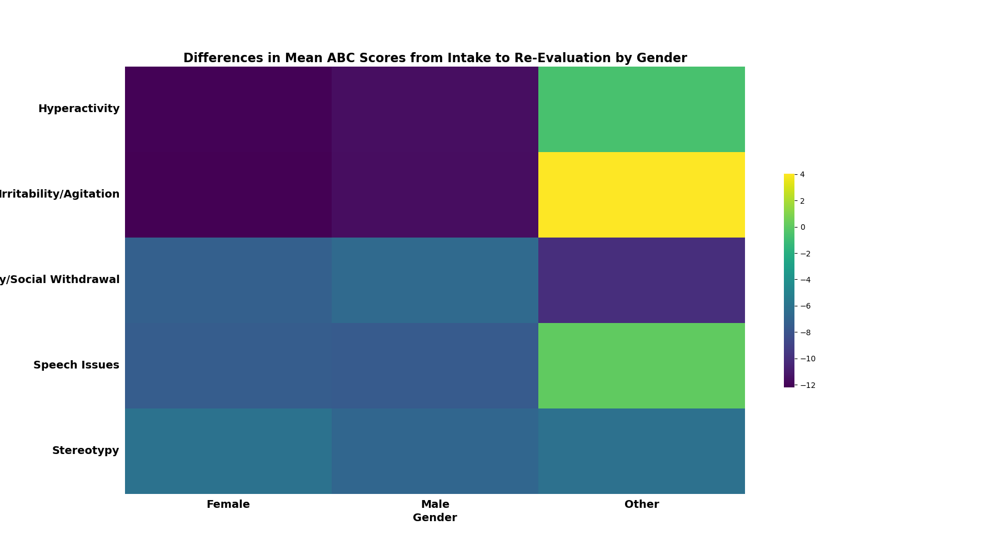
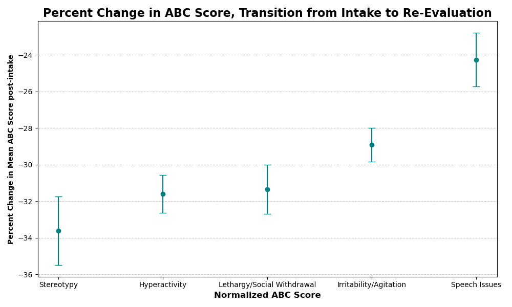
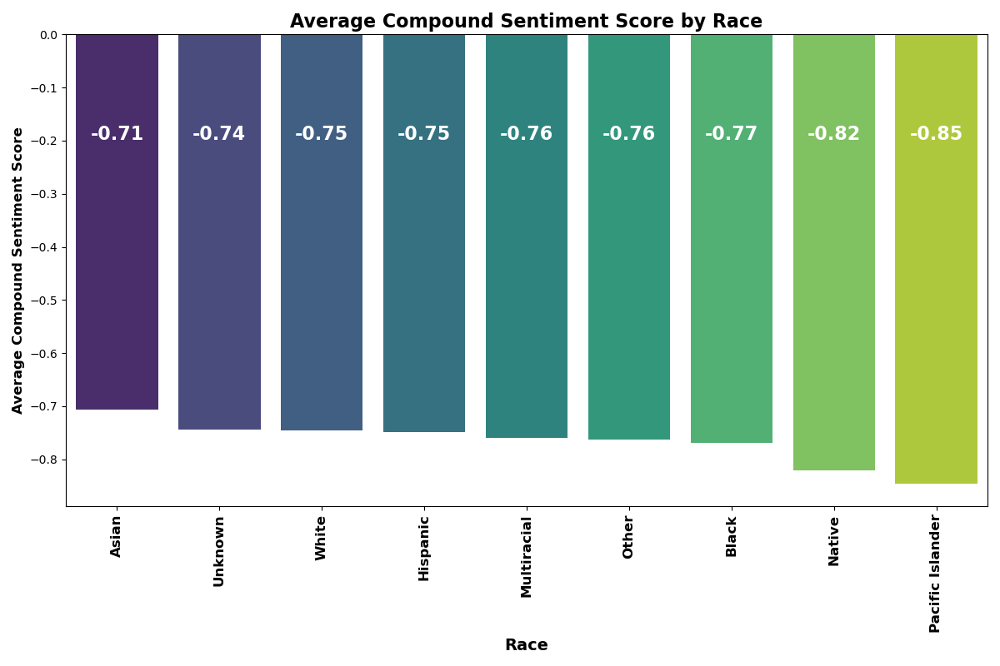

# QSS-2O-Final-Project-

# I. Repository Overview
This is the private repository for Anna Block, Mary Ford, Grace Wilkins, and Ava Politis' Final Project. The main components are the data, code, and output for our project. Our code files are 1) [01_merge_demographics](code/01_merge_clean_demographics.ipynb) which inputs our raw datasets, merges, and cleans the data 2) [02_regression](code/02_regression.ipynb) which inputs our newly merged dataset, runs our regression for ABC score changes, and outputs a forest plot of regression coefficients 3) [03_coefficient_plot](code/03_coefficient_plot.ipynb) which takes in our merged dataset, runs our visualization of the coefficient plot of demographic factors, and ouputs a visualization of our statistical analyses 4) [04_intake_reeval_heatmaps](code/04_intake_reeval_heatmaps.ipynb) which take in our merged dataset, generates heatmaps for differences in ABC score across demographic categories, and outputs three separate heatmaps visualizing improvements by gender, race, and disability 5) [05_sentiments](code/05_sentiments.ipynb) which takes in our merged dataset, analyzes sentiment scores based on demographics, and outputs two bar plots which examine sentiment by gender and race 6) [06_topic_modelling](code/06_topic_modelling.ipynb) which takes in our merged dataset, runs an LDA model, and outputs a heatmap that displays the distribution of LDA topics across different racial groups. Due to the structured nature of our data, we decided to omit the final result (06_topic_modelling) from our final work. All code files should be read in in the order in which they are numbered. Our output files are 1) [coefficient_plot](output/coefficient_plot.png) 2) [heatmap_disability](output/heatmap_disability.png) 3) [heatmap_race](output/heatmap_race.png) 4) [heatmap_gend](output/heatmap_gend.png) 5) [ols_regression](ols_regression.png) 6) [sentiment_gender](output/sentiment_gender.png) 7) [sentiment_race](output/sentiment_race.png). The purpose of our project is as follows. 

# II. Purpose of Project
The purpose of this project was to evaluate the impact demographic features have on patient outcomes in the START program. It was hypothesized that gender, race, and disability do not have an impact on treatment outcomes. 

# III. Relevant Data Sources
In our work, we examined Aberrant Behavior Checklist (ABC) Scores, a quantitative measure of patient condition at the time of intake as compared to condition post treatment in terms of lethargy/social withdrawal, irritability/agitation, stereotypy, hyperactivity, and speech issues, along demographic lines (gender, race, and disability). In 2023, Cho, Sapan, and Sikhinam examined START involvement between January 2019 and December 2020. In our project, we build on their work, expanding the time frame (starting in 2009, the earliest year in the data set) to understand larger trends within the START data set and identify major inflection points in care. 

# IV. Results: A Snapshot of Key Findings 

# V. Applications
This project will be used by the National Center for START Services (NCSS) at the Institute on Disability at University of New Hampshire (UNH) to evaluate the quality of the treatment program. With the finding that involvement in the START program lowers the average ABC Score of participants from intake to re-evaluation, our work points to the promise of the START program and need for continued funding of its services. 
